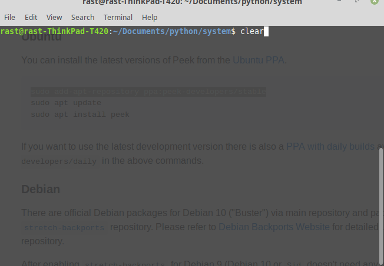
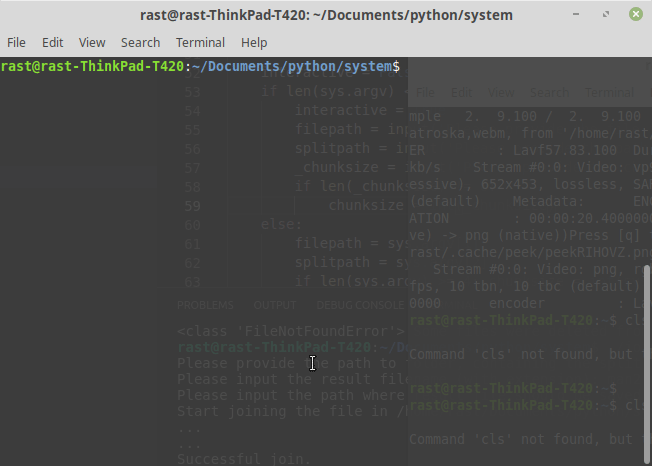

# **SPLIT/JOIN files**

Above named scripts are used to split, and then join big files in chunks.
#### *split.py* 
##### Usage: python split.py \[PATH-TO-FILE\] \[RESULT-FOLDER\] \[CHUNK-SIZE\]
  - **PATH-TO-FILE** - path to the file to be split
  - **RESULT-FOLDER** - folder name/path where the chunks will be saved (created the folder if it doesn't already exist)
    ***Warning: if an existing folder provided, the script will delete all the files already contained there***
  - **CHUNK-SIZE** - Size of the information chunk in bytes (ex 1024 for 1Kb etc.).
    If skipped, files will be split in chunks of 1 MB.

##### All the arguments are optional, if none provided, the user will get prompted to input the values interactively.
##### The script creates an metadata textfile containing some information about the operation as follows:
1. Original file checksum (will be checked on joining to assure file integrity)
2. Number of chunks created.
3. The length of the file name created (Depends on the number of chunks created)

## NORMAL vs. INTERACTIVE usage:

# =============================

#### *join.py* 
##### Usage: python join.py \[PATH-TO-CHUNKS\] \[RESULT-FILE\] \[RESULT-FOLDER\]
  - **PATH-TO-CHUNKS** - path to the folder containing the chunks to be joined
  - **RESULT-FILE** - File name to be created out of the chunks. Extension should be mentioned.
  - **RESULT-FOLDER** - Optional folder where the result-file will be saved. If none provided, defaults to the current working directory.
  
##### If the metadata textfile is deleted, the script will still try to join the files, but will warn the user that data might get corrupted. If metadata was the only file deleted, that should not be a big problem normally. If any other chunks were deleted, the file might get corrupted.
